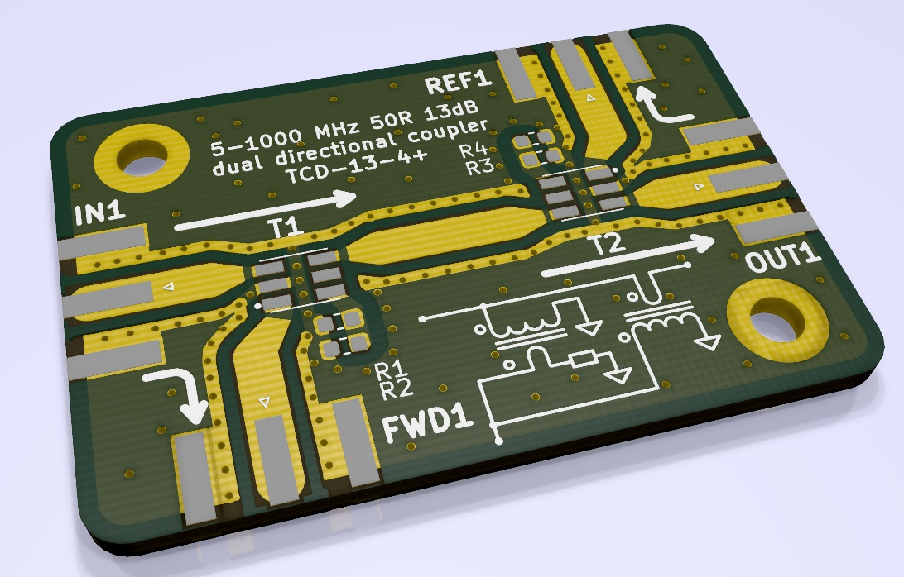
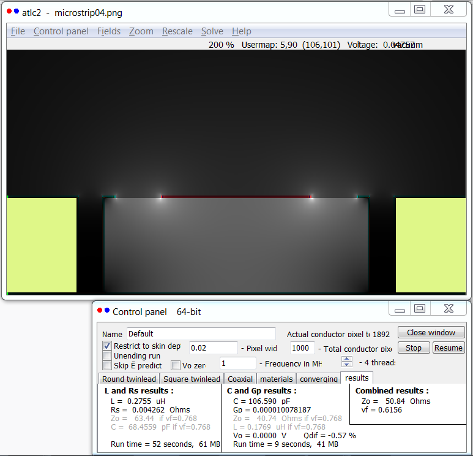

# EVAL-TCD13-4
A 13 dB dual directional coupler designed with two Mini-Circuits TCD13-4+ for 5 to 1000 MHz.
Designed with KiCAD and tested in hardware.

## board view

The coupler is implemented using common Tg150 FR4 in 1.6 mm thickness and has four SMA edge ports.
50 Ohm traces are implemented as fenced stripline and tapered to connect to the transformer pads. 

the silkscreen showcases one of two 0° directional couplers, the kind which is detailed in [the excellent article by Michael G. Ellis](http://www.members.tripod.com/michaelgellis/direct.html)

## design

The design of the trace geometry to achieve 50 Ohm impedance was done using [atlc2](http://www.hdtvprimer.com/kq6qv/atlc2.html).
Via fencing may be a bit academic in this case but was implemented for educational purposes and because it is not reflected in the cost for the PCB.

## test results

One board was assembled and tested over 0.5 - 1800 MHz using an HP 4396B network analyzer. Coupling was found to be -12.6 dB at 900 MHz, with good flatness over the targeted frequency range.
Insertion loss and directivity are in agreement with typical values given in the [TCD13-4+](https://www.minicircuits.com/WebStore/dashboard.html?model=TCD-13-4%2B) characterization from Mini-Ciruits.